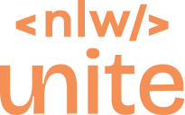
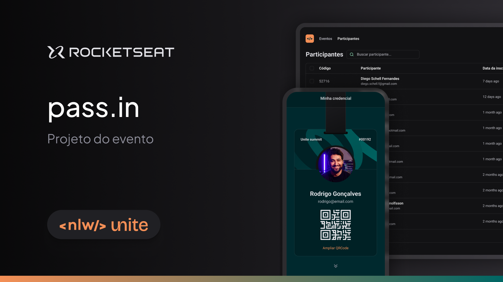

  

</a>

 Um app para gestão de participantes em eventos presenciais 

 
    <a href="#-sobre-o-projeto">Projeto</a>&nbsp;&nbsp;&nbsp;│&nbsp;&nbsp;&nbsp;
    <a href="#-tecnologias">Tecnologias</a>&nbsp;&nbsp;&nbsp;│&nbsp;&nbsp;&nbsp;
    <a href="#-features">Features</a>&nbsp;&nbsp;&nbsp;│&nbsp;&nbsp;&nbsp;
    <a href="#-licença">Licença</a>&nbsp;&nbsp;&nbsp;│&nbsp;&nbsp;&nbsp;
    <a href="#-dicas-para-usar-o-projeto">Dicas de uso</a>

    
    
    

### 💻 Sobre o projeto

O projeto permite que o organizador cadastre um evento e abra uma página pública de inscrição. Os participantes inscritos podem emitir uma credencial para check-in no dia do evento. O sistema fará um scan da credencial do participante para permitir a entrada no evento.

 

  

### 🚀 Tecnologias

Esse projeto foi desenvolvido com as seguintes tecnologias:

- React e Vite
- Typescript
- Tailwind
- SQLite
- Git e Github
- Figma

### 🚧 Features

- [ ] O organizador deve poder cadastrar um novo evento
- [ ] O organizador deve poder visualizar dados de um evento
- [x] O organizador deve poser visualizar a lista de participantes
- [ ] O participante deve poder se inscrever em um evento
- [ ] O participante deve poder visualizar seu crachá de inscrição
- [ ] O participante deve poder realizar check-in no evento
- [x] O participante só pode se inscrever em um evento uma única vez
- [x] O participante só pode se inscrever em eventos com vagas disponíveis
- [x] O participante só pode realizar check-in em um evento uma única vez
- [x] O check-in no evento será realizado através de um QRCode

### Documentação da API (Swagger)

Para documentação da API com o server em execução, acesse o link: [docs](http://localhost:3333/docs)

### 📜 Licença

Esse projeto está sob a licença MIT.

### 💡 Dicas para usar o projeto

`npm i` ou `npm install` para baixar o node_modules

`npm run dev` para conseguir visualizar o projeto no web (http://localhost:5173)

---

Projeto feito através de uma aula da rocketseat. Alterado e adicionado algumas funcionalidades por KetCode.